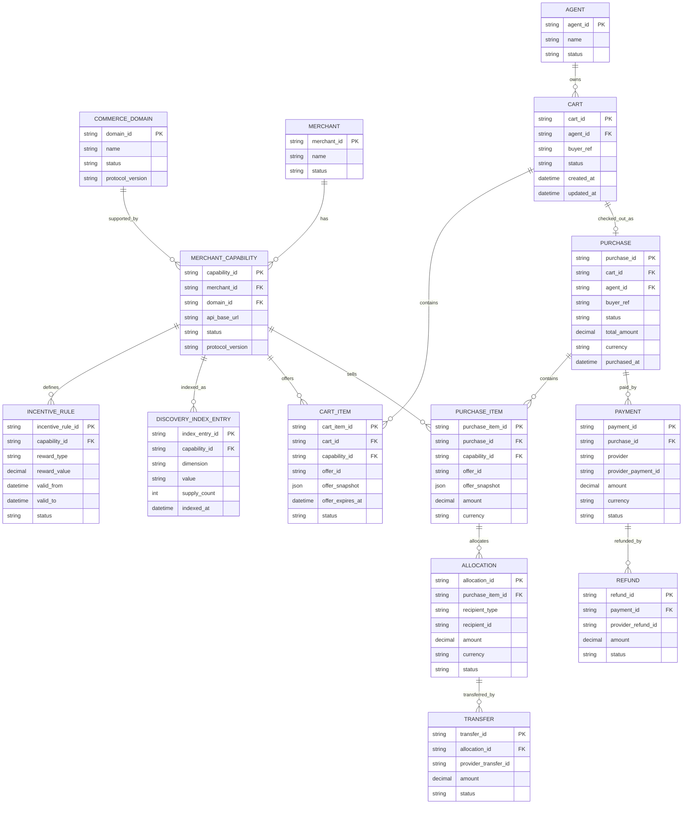

# Offenro Protocol Model / Database Schema


## ER図



---

# 各テーブル

## COMMERCE_DOMAIN

Offenroが対応する購買Domainを管理する。

`travel.hotel`や`retail.shoes`等の**検索・購買対象の分類**を表す。

| Property | 内容 / 取りうる値 |
|---|---|
| `domain_id` | Domain識別子。例：`travel.hotel` |
| `name` | 表示名。例：`Hotel` |
| `status` | `ACTIVE` / `INACTIVE` / `DEPRECATED` |
| `protocol_version` | Domain ContractのProtocol Version。例：`0.1.0` |

### status

- `ACTIVE`：利用可能
- `INACTIVE`：一時的に利用停止
- `DEPRECATED`：廃止予定。新規利用は非推奨

---

## MERCHANT

Offenroと提携する販売元・サービス提供者を管理する。

DomainやAPI URLはMerchant自身ではなく、`MERCHANT_CAPABILITY`で管理する。

| Property | 内容 / 取りうる値 |
|---|---|
| `merchant_id` | Merchant識別子 |
| `name` | Merchant名 |
| `status` | `PENDING` / `ACTIVE` / `SUSPENDED` / `CLOSED` |

### status

- `PENDING`：登録途中
- `ACTIVE`：利用可能
- `SUSPENDED`：一時停止
- `CLOSED`：契約終了・利用終了

---

## MERCHANT_CAPABILITY

Merchantが**どのCommerce Domainに対応しているか**を管理する。

`Merchant × CommerceDomain`を表す。

例：

```text
merchant_001 × travel.hotel
merchant_001 × retail.shoes
```

| Property | 内容 / 取りうる値 |
|---|---|
| `capability_id` | Capability識別子 |
| `merchant_id` | Merchant |
| `domain_id` | 対応Commerce Domain |
| `api_base_url` | Merchant API URL |
| `status` | `PENDING_VERIFICATION` / `ACTIVE` / `VERIFICATION_FAILED` / `SUSPENDED` |
| `protocol_version` | Merchantが実装しているProtocol Version |

### status

- `PENDING_VERIFICATION`：API登録済み・検証前
- `ACTIVE`：API検証済み・利用可能
- `VERIFICATION_FAILED`：API検証失敗
- `SUSPENDED`：一時停止

---

## INCENTIVE_RULE

MerchantがCommerce Domainごとに設定するAgentへの成果報酬条件。

`MERCHANT_CAPABILITY`に対して設定する。

例：

```text
Merchant A
travel.hotel
Agent Reward = 5%
```

| Property | 内容 / 取りうる値 |
|---|---|
| `incentive_rule_id` | Incentive Rule識別子 |
| `capability_id` | 対象Merchant Capability |
| `reward_type` | `PERCENTAGE` / `FIXED` |
| `reward_value` | 還元率または固定金額 |
| `valid_from` | 適用開始日時 |
| `valid_to` | 適用終了日時。無期限の場合NULL可 |
| `status` | `DRAFT` / `ACTIVE` / `INACTIVE` / `EXPIRED` |

### reward_type

- `PERCENTAGE`：割合。例：`5.0` = 5%
- `FIXED`：固定額。例：`500` = 500円

### status

- `DRAFT`：設定途中
- `ACTIVE`：現在適用中
- `INACTIVE`：無効化済み
- `EXPIRED`：有効期限終了

---

## DISCOVERY_INDEX_ENTRY

検索時に、問い合わせるべきMerchantを高速に逆引きするためのIndex。

価格や在庫などの動的情報は持たない。

例：

```text
travel.hotel
prefecture_code = 14
merchant_001
supply_count = 12
```

| Property | 内容 |
|---|---|
| `index_entry_id` | Index識別子 |
| `capability_id` | 対象Merchant Capability |
| `dimension` | Index軸。例：`prefecture_code`, `brand` |
| `value` | Index値。例：`14`, `nike` |
| `supply_count` | 該当商品の概算供給数 |
| `indexed_at` | Index作成日時 |

---

## AGENT

Offenro Protocolを利用するAgentアプリ・Agent開発者を管理する。

| Property | 内容 / 取りうる値 |
|---|---|
| `agent_id` | Agent識別子 |
| `name` | Agent名 |
| `status` | `PENDING` / `ACTIVE` / `SUSPENDED` / `CLOSED` |

### status

- `PENDING`：登録途中
- `ACTIVE`：利用可能
- `SUSPENDED`：一時停止
- `CLOSED`：利用終了

---

## CART

Userが**購入候補としてProtocol側に保持したOfferの集合**。

Agent内部で比較・検討しているだけの候補は保存しない。

Userが「購入候補として保持する」と決めた時点からCartとしてProtocolが管理する。

| Property | 内容 / 取りうる値 |
|---|---|
| `cart_id` | Cart識別子 |
| `agent_id` | Cartを作成したAgent |
| `buyer_ref` | Agent側Userを識別するOpaque ID |
| `status` | `ACTIVE` / `CHECKED_OUT` / `ABANDONED` / `EXPIRED` |
| `created_at` | 作成日時 |
| `updated_at` | 更新日時 |

### status

- `ACTIVE`：購入候補を編集可能
- `CHECKED_OUT`：Purchaseへ確定済み
- `ABANDONED`：Userが破棄
- `EXPIRED`：有効期限切れ

---

## CART_ITEM

Cartに保存された個別Offer。

検索時点のOffer情報をSnapshotとして保持する。

| Property | 内容 / 取りうる値 |
|---|---|
| `cart_item_id` | Cart Item識別子 |
| `cart_id` | 所属Cart |
| `capability_id` | Offer提供元Merchant Capability |
| `offer_id` | Merchant / Protocol上のOffer ID |
| `offer_snapshot` | Cart追加時点のOffer情報 |
| `offer_expires_at` | Offer有効期限 |
| `status` | `ACTIVE` / `REMOVED` / `EXPIRED` |

### status

- `ACTIVE`：購入候補
- `REMOVED`：Cartから除外
- `EXPIRED`：Offer期限切れ

`offer_snapshot`は参考情報であり、購入確定時にはMerchant APIで価格・在庫等を再確認する。

---

## PURCHASE

UserがCartをCheckoutし、購入を確定した取引。

PaymentやTransfer等の状態は別モデルで管理し、Purchase Statusへ集約しすぎない。

| Property | 内容 / 取りうる値 |
|---|---|
| `purchase_id` | Purchase識別子 |
| `cart_id` | 元Cart |
| `agent_id` | 購入を仲介したAgent |
| `buyer_ref` | Agent側User識別子 |
| `status` | `CREATED` / `CONFIRMED` / `CANCELLED` |
| `total_amount` | Purchase総額 |
| `currency` | ISO通貨コード。例：`JPY` |
| `purchased_at` | 購入確定日時 |

### status

- `CREATED`：Purchase生成済み
- `CONFIRMED`：Merchant側でも購入成立
- `CANCELLED`：購入取消

Payment状態やRefund状態はここには持たない。

---

## PURCHASE_ITEM

Purchaseに含まれる個別の商品・サービス。

購入確定時点のOffer情報をSnapshotとして保存する。

| Property | 内容 |
|---|---|
| `purchase_item_id` | Purchase Item識別子 |
| `purchase_id` | Purchase |
| `capability_id` | 販売したMerchant Capability |
| `offer_id` | 元Offer |
| `offer_snapshot` | 購入確定時点のOffer情報 |
| `amount` | 購入金額 |
| `currency` | 通貨 |

`offer_snapshot`は購入後の監査・照会のため保持する。

---

## PAYMENT

Userからの決済を管理する。

実際の資金処理はStripe等のPSPが行う。

1 Purchaseに対して、再試行等を考慮し複数Paymentを持てる。

| Property | 内容 / 取りうる値 |
|---|---|
| `payment_id` | Payment識別子 |
| `purchase_id` | 対象Purchase |
| `provider` | PSP。例：`stripe` |
| `provider_payment_id` | PSP側Payment ID |
| `amount` | 決済金額 |
| `currency` | 通貨 |
| `status` | `PENDING` / `AUTHORIZED` / `CAPTURED` / `FAILED` / `CANCELLED` |

### status

- `PENDING`：決済処理中
- `AUTHORIZED`：支払手段承認済み・未確定
- `CAPTURED`：決済確定
- `FAILED`：決済失敗
- `CANCELLED`：決済取消

---

## ALLOCATION

購入代金について、**誰にいくら帰属する予定か**を管理する。

実際の資金移動ではない。

例：

```text
User Payment = 10,000円

Merchant  = 9,200円
Agent     =   500円
Protocol  =   300円
```

| Property | 内容 / 取りうる値 |
|---|---|
| `allocation_id` | Allocation識別子 |
| `purchase_item_id` | 対象Purchase Item |
| `recipient_type` | `MERCHANT` / `AGENT` / `PROTOCOL` |
| `recipient_id` | 配分先ID |
| `amount` | 配分予定額 |
| `currency` | 通貨 |
| `status` | `PENDING` / `CONFIRMED` / `TRANSFERRED` / `REVERSED` |

### status

- `PENDING`：購入時に仮配分
- `CONFIRMED`：成果確定・配分確定
- `TRANSFERRED`：実資金移動完了
- `REVERSED`：キャンセル・Refund等により取消

---

## TRANSFER

Allocationに基づく**実際の資金移動**を管理する。

PSPを通してMerchantやAgentへ送金する。

| Property | 内容 / 取りうる値 |
|---|---|
| `transfer_id` | Transfer識別子 |
| `allocation_id` | 対象Allocation |
| `provider_transfer_id` | PSP側Transfer ID |
| `amount` | Transfer金額 |
| `status` | `PENDING` / `SUCCEEDED` / `FAILED` / `REVERSED` |

### status

- `PENDING`：送金処理中
- `SUCCEEDED`：送金成功
- `FAILED`：送金失敗
- `REVERSED`：送金取消・Reverse Transfer済み

Protocol自身へのAllocationは、PSP上で資金を保持する場合、Transferを作成しない場合がある。

---

## REFUND

Userへの返金を管理する。

部分返金を考慮し、1 Paymentに複数Refundを持てる。

| Property | 内容 / 取りうる値 |
|---|---|
| `refund_id` | Refund識別子 |
| `payment_id` | 元Payment |
| `provider_refund_id` | PSP側Refund ID |
| `amount` | 返金額 |
| `status` | `PENDING` / `SUCCEEDED` / `FAILED` / `CANCELLED` |

### status

- `PENDING`：返金処理中
- `SUCCEEDED`：返金成功
- `FAILED`：返金失敗
- `CANCELLED`：返金取消

Refund発生時は、関連するAllocation / Transferについても必要に応じて`REVERSED`処理を行う。

---

# Protocol内のデータ保持境界

```text
Agent
────────────────────────
検索条件
検索履歴
候補比較
ランキング
Userとの会話
User Feedback
購入前の一時候補


Offenro Protocol
────────────────────────
Merchant / Capability
Discovery Index
Cart
Purchase
Payment
Allocation
Transfer
Refund


Merchant
────────────────────────
商品マスタ
価格
在庫
予約状況
商品・サービス提供状態


PSP
────────────────────────
実際の資金
Payment
Transfer
Refund
Payout
```

---

# 主要な状態遷移

## Cart

```text
ACTIVE
 ├─→ CHECKED_OUT
 ├─→ ABANDONED
 └─→ EXPIRED
```

## Purchase

```text
CREATED
 ├─→ CONFIRMED
 └─→ CANCELLED
```

## Payment

```text
PENDING
 ├─→ AUTHORIZED
 │     └─→ CAPTURED
 ├─→ CAPTURED
 ├─→ FAILED
 └─→ CANCELLED
```

## Allocation

```text
PENDING
 ├─→ CONFIRMED
 │     └─→ TRANSFERRED
 └─→ REVERSED
```

## Transfer

```text
PENDING
 ├─→ SUCCEEDED
 │     └─→ REVERSED
 └─→ FAILED
```

## Refund

```text
PENDING
 ├─→ SUCCEEDED
 ├─→ FAILED
 └─→ CANCELLED
```

---

# 設計ルール

- `CommerceDomain`はDDDのDomainではなく、検索・購買対象の分類を表す。
- Merchantの対応Domainは`MerchantCapability`で管理する。
- Incentiveは原則`MerchantCapability`単位で設定する。
- Agent上の単なる候補はProtocolへ保存しない。
- Userが購入候補として明示的に保持した時点から`Cart`としてProtocolが管理する。
- Cart追加時のOfferと購入確定時のOfferは異なる可能性があるため、Checkout時にMerchantへ再確認する。
- 購入確定情報は`PurchaseItem.offer_snapshot`へ保存する。
    - Cart追加時のOfferと購入確定時のOfferは異なる可能性があるため、Checkout時にMerchantへ再確認する。(このsnapshotoを利用)

- Discovery Indexへ価格・在庫等の変動情報は原則保存しない。
- `Payment`、`Allocation`、`Transfer`、`Refund`は別々の状態を持つ。
- `Allocation`は資金の帰属予定、`Transfer`は実際の資金移動であり、同じ概念として扱わない。
- Userのプロフィール等はProtocolで管理せず、Agent側Userを`buyer_ref`で参照する。
- Domain固有の商品情報はProtocol共通テーブルの固定Columnへ展開せず、OpenAPI ContractとSnapshotで扱う。

---

# 現時点でER対象外のモデル

以下は必要になった段階で別モデルとして追加する。

- Fulfillment
- Issue / Dispute
- Merchant Payout Account
- Authentication / API Key
- Campaign
- Incentiveの詳細条件
- Settlement Batch

特に`Fulfillment`や`Issue`は、Purchaseの`status`へ無理に統合せず、必要になった時点で独立モデルとして追加する。
