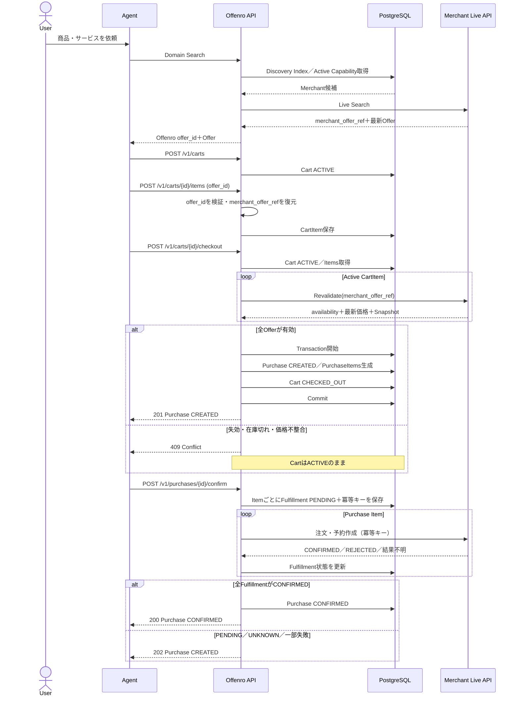
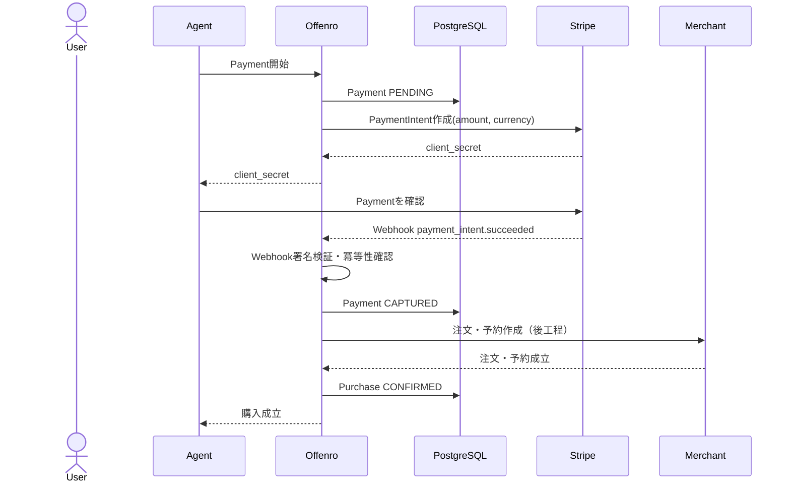

# Agent購入シーケンス

## 今回の実装範囲

`Purchase.CREATED`はMerchant側の注文・予約成立を意味しない。`Purchase.CONFIRMED`は全Purchase ItemのMerchant注文が成立した時点にだけ設定する。結果不明時は同じ冪等キーでMerchantの状態を照会し、二重注文を防ぐ。

## 次工程のStripe決済

Payment状態とPurchase状態を同一視しない。Stripeの最終結果はAgentからの戻りではなく署名検証済みWebhookで反映する。
