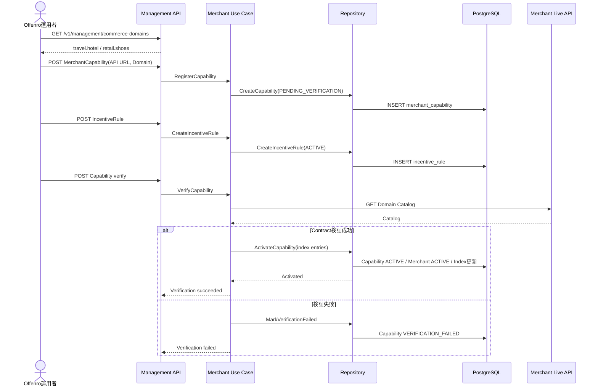

# Merchant出品シーケンス

Merchantの商品マスタをOffenroへ登録しない。MerchantはDomainごとのLive APIを実装し、OffenroへCapabilityとして公開する。

```mermaid
sequenceDiagram
    actor Operator as Offenro運用者
    participant Management as Management API
    participant UseCase as Merchant Use Case
    participant Repository as Repository
    participant DB as PostgreSQL
    participant Merchant as Merchant Live API

    Operator->>Management: GET /v1/management/commerce-domains
    Management-->>Operator: travel.hotel / retail.shoes

    Operator->>Management: POST MerchantCapability(API URL, Domain)
    Management->>UseCase: RegisterCapability
    UseCase->>Repository: CreateCapability(PENDING_VERIFICATION)
    Repository->>DB: INSERT merchant_capability

    Operator->>Management: POST IncentiveRule
    Management->>UseCase: CreateIncentiveRule
    UseCase->>Repository: CreateIncentiveRule(ACTIVE)
    Repository->>DB: INSERT incentive_rule

    Operator->>Management: POST Capability verify
    Management->>UseCase: VerifyCapability
    UseCase->>Merchant: GET Domain Catalog
    Merchant-->>UseCase: Catalog

    alt Contract検証成功
        UseCase->>Repository: ActivateCapability(index entries)
        Repository->>DB: Capability ACTIVE / Merchant ACTIVE / Index更新
        Repository-->>UseCase: Activated
        UseCase-->>Management: Verification succeeded
    else 検証失敗
        UseCase->>Repository: MarkVerificationFailed
        Repository->>DB: Capability VERIFICATION_FAILED
        UseCase-->>Management: Verification failed
    end
```

Capabilityが`ACTIVE`になるまでAgent検索対象に含めない。
