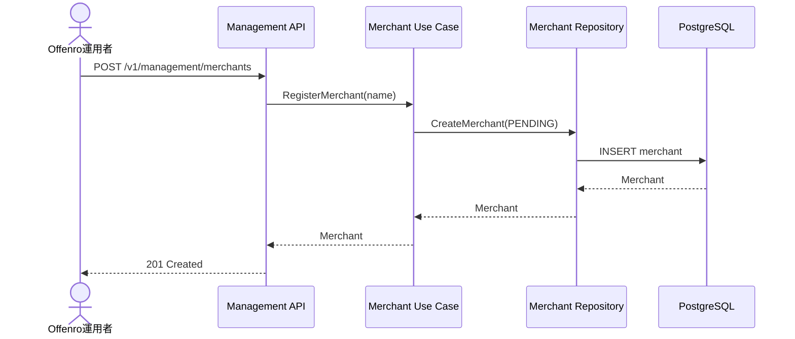

# Merchant登録シーケンス

```mermaid
sequenceDiagram
    actor Operator as Offenro運用者
    participant API as Management API
    participant UseCase as Merchant Use Case
    participant Repository as Merchant Repository
    participant DB as PostgreSQL

    Operator->>API: POST /v1/management/merchants
    API->>UseCase: RegisterMerchant(name)
    UseCase->>Repository: CreateMerchant(PENDING)
    Repository->>DB: INSERT merchant
    DB-->>Repository: Merchant
    Repository-->>UseCase: Merchant
    UseCase-->>API: Merchant
    API-->>Operator: 201 Created
```

Merchantは登録直後には`PENDING`とする。CapabilityのLive API検証に成功した時点で`ACTIVE`へ遷移する。
